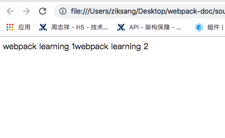

# 入口起点(entry point)

在上一章概念中已经对`entry`配置有了初步的认识,同时`entry`在`webpack`存在多种方式去进行配置,如果对上一章概念认识阅读的,提到过可以配置多入口方案。

## 前置基础工程目录

```
.webpackProject
 |--src
 |   |---index.js
 |--webapck.config.js
```

## 单文件单入口,单页面打包方式

用法: `entry: string`

> 简写语法

webpack.config.js

```
module.exports = {
    entry: './src/index.js'
}
```

以上的写法是以下方法的简写方式

```
module.exports = {
    entry: {
        main: './src/index.js'
    }
}
```

运行`webpack`在当前目录下生成`dist`目录,并且生成`main.js`文件

::: tip
本节学习课程demo下载文件夹为[lesson5](https://github.com/494755899/Webpack-learning/tree/master/source)
:::

## 多文件单入口,单页面打包方式

用法: `entry: Array(string)`

使用`entry`选项创建一个入口的时候,不但可以使用字符串的方式,而且还可以通过数组的方式写入不同的文件路径,如果你想把多个依赖文件注入在一起时，通过数组的方式就可以灵活运用

```
webpackProject
 ├── src
-|   |── index.js
+|   ├── index1.js  写入 document.write('webpack learning 1')
+|   ├── index2.js  写入 document.write('webpack learning 2')
 |———webpack.config.js
```

如果想把`index1.js`的文件中的代码和`index2.js`中的代码同时打包到一个入口中,用数组方式定义`entry`再合适不过了

webpack.config.js

```
module.exports = {
    entry: ['./src/index1.js', './src/index2.js']
}
```

运行`webpack`命令。

打包完成后在根目录下会生成`dist`目录,同时内部添加了一个`main.js`。`index1.js`和`index2.js`文件的执行代码会被顺序的打入。

```
webpackProject
 |── dist
 |   |--index.html
 |   |--main.js 
 ├── src
 |   ├── index1.js  写入 document.write('webpack learning 1')
 |   ├── index2.js  写入 document.write('webpack learning 2')
 |-- webpack.config.js
```

在`dist`目录下创建`index.html`,写入基本的`html`结构。在底下通过`script`引下`main.js`文件

在打包生成后的`dist`目录下创建`index.html`

```
<!DOCTYPE html>
<html lang="en">
<head>
    <meta charset="UTF-8">
    <title>Document</title>
</head>
<body>
</body>
<script src="./main.js"></script>
</html>
```

在浏览打开`html`页面,可以发现在页面中写入了



::: tip
本节学习课程demo下载文件夹为[lesson6](https://github.com/494755899/Webpack-learning/tree/master/source)
:::

通过图片可以证明通过数组的方把多个文件打入一个入口的时候，执行结果是从左到右打入的方式进行执行的。

## 多文件多入口,多页面打包方式

用法： `entry: {[entryChunkName: string]: string|Array(string>)`
```
webpackProject
 |── dist
 |   |--index1.html
 |   |--index2.html
 |   |--index1.js
 |   |--index2.js
 ├── src
 |   ├── index1.js  写入 document.write('webpack learning 1')
 |   ├── index2.js  写入 document.write('webpack learning 2')
 |-- webpack.config.js
```

可以通过对象的语法创建多个入口。

webpack.config.js

```
module.exports = {
    entry: {
        index1: './src/index.js',
        index2: './src/index2.js'
    }
}
```
运行`webpack`命令

告诉`webpack`此时需要创建二个独立的模块(创建自己独立的依赖图)，分别需要引入到对应的`html`文件中,在`entry`中定义的属性则是最后打包生成后的包名。值则是对应路径文件中打包的代码。

通过运行`webpack`,可以发现`dist`目录下生成了`index1.js`和`index2.js`,分别手动把这两个`js`引入到对应的`index1.html`和`index2.html`当中。打开页面发会生成对应的内容。

这只是一个简单生成两个页面的对应入口，如果有更多的页面，则需要借且一些其它插件和依赖包。进行自动创建入口和自动插入到`html`当中。


::: tip
本节学习课程demo下载文件夹为[lesson7](https://github.com/494755899/Webpack-learning/tree/master/source)
:::


## 多页面打包造成的问题

::: warning
对于多入口的打包方式,必然会存在每个入口引用到同一个第三方包和公用函数。这种情况下每个入口都会打入同样的第三方的包和公用函数。可以利用`webapck4.x`的`optimization.splitChunks`在每个页面中创建共享代码,这样可以充分的利用缓存和减少代码的重复问题
:::

```
webpackProject
 |── dist
 |   |--index1.html
 |   |--index2.html
 |   |--index1.js
 |   |--index2.js
 ├── src
+|   ├── util.js
 |   ├── index1.js
 |   ├── index2.js
 |-- webpack.config.js
```

util.js
```
export const a = 'webpack learning'
```

src/index1.js
```
import { a } from './util.js
document.write(a)
document.write('file is index1')
```

src/index2.js

```
import { a } from './util.js
document.write(a)
document.write('file is index2')
```

添加`mode`为`development`为了不让打包后的代码进行压缩，方便查看引入了那些代码

webpack.config.js

```
module.exports = {
   +mode: 'development', 
    entry: {
        index1: './src/index.js',
        index2: './src/index2.js'
    }
}
```

运行webpack

```
/***/ "./src/util.js":
/*!*********************!*\
  !*** ./src/util.js ***!
  \*********************/
/*! exports provided: a */
```

分别打开`dist`目录下`index1.js`和`index2.js`可以发现都会有这段代码。说明打包后了两个页面入口的js分别都打入了`./src/util.js`中导出的`a`变量

在一般情况下，对于工具包都会在主入口文件执行的时候之前就引入。这样就可以充分的利用缓存。当第一个页面加载完成后。第二个页面主要加载业务代码。而这些公用代码则可以利用缓存进行复用。不需要从服务端重新获取。

像以上情况，把所工具函数都打入入口文件，会导致文件包的过大。无法利用缓存提高加载性能。所以需要通过`optimization.splitChunks`选项进行代码分离提取。

::: tip
本节学习课程demo下载文件夹为[lesson8](https://github.com/494755899/Webpack-learning/tree/master/source)
:::

### 总结：

1. 创建单个入口可以通过字符串的写法。
2. 通过多个入口创建一个入口通过数组的方式。
3. 多页面创建，创建多个入口时，可以通过对象的方式，但是注意多入口的打包方式不做优化分离提取公共部分，会造成包的过大和不能利用浏览器缓存机制。